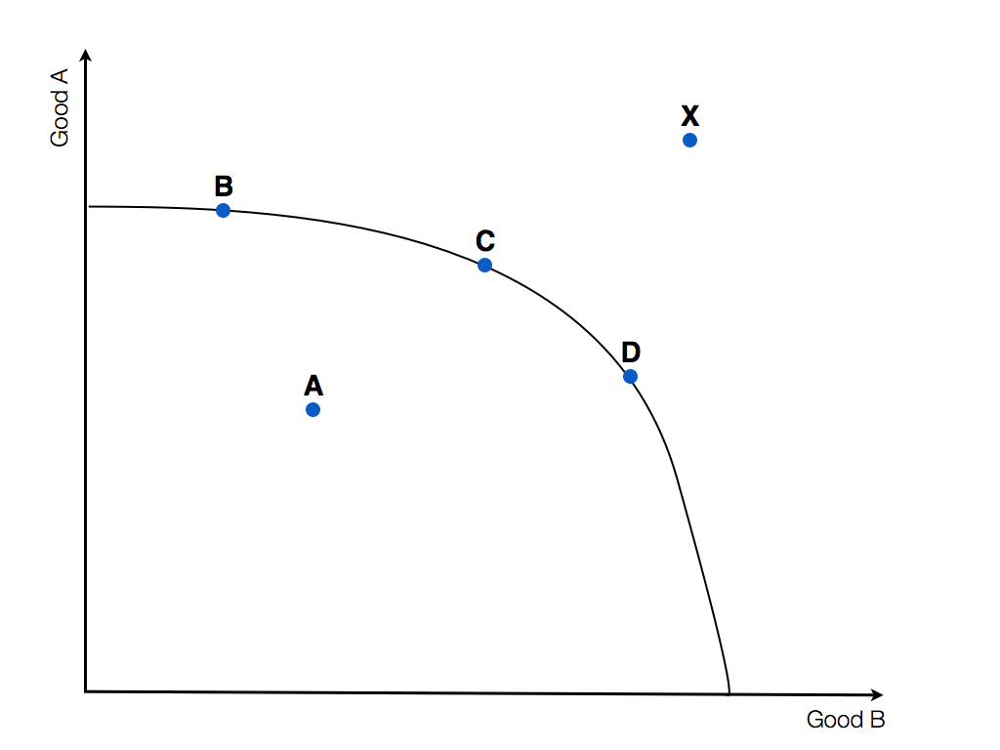

% Economics, a Comprehensive Guide
% Jethro Kuan, Vishnu R. Menon

\clearpage

# Preface
## Preface
\clearpage

# Part 1: Microeconomics

## Scarcity, Opportunity Cost and Economic Efficiencies

### Scarcity
Scarcity means that society has __limited resources__ and __unlimited wants__. Economics, in turn, is the study of choices individuals make and its consequences.

Our society faces the scarcity of four resources:

1. __Labour__: time humans spend in producing goods and services
2. __Capital__
    a. __Physical__:  physical goods; machinery, equipment etc.
    b. __Human__: skills/knowledge of the labour force
3. __Land__: physical space on which production takes place
4. __Entrepeneurship__: ability and willingness to combine the above 3 resources

### Opportunity Cost
Opportunity cost is defined as the following:

> __Opportunity cost__ is the cost of an alternative that must be forgone in order to pursue a certain action.

Such costs come in different forms, but under either __explicit costs__ or __implicit costs__. Explicit costs refer to the _dollars sacrificed_, while implicit costs refer to the _value of something sacrificed when no direct payment is made_.

All production carries with it an opportunity cost, because resources are allocated into producing a good, which could be allocated to the production of other goods.

#### The Law of Opportunity Cost

> __The Law of Opportunity Cost__ states that the more of something we produce, the greater the opportunity cost of producing it.

This results in the concave shape of the PPC curves.

Opportunity costs are however not easily calculated, for it __requires time and information__. Opportunity cost also __varies with circumstance__, and a context is required for such calculations. This can lead to implicit costs varying widely in different circumstances.

### Rational Choices
Choices involve the weighing of the benefits of any activity against its opportunity cost. That is consumers, consuming a particular amount of a good by considering the marginal costs and marginal benefits of the good. You will get more familiar with this concept in [market failure](#mf).

### Efficiency, and the PPC
PPC stands for Production Possibilities Curve. It is a curve showing all combinations of 2 goods (Axis labelled "Good A" and "Good B") that can be produced with the resources and technology currently available.

  

Any point on the curve (Points B,C and D) indicate that the economy has achieved __productive efficiency__. Point A lies inside the curve, so if the economy operates at point A, the economy is __productive inefficient__. Point X lies outside the curve, and this point is unattainable with the economy's current amount of resources and technology. Over time, the production possibilities of a nation are likely to increase. Investment in new plant and machinery will increase the stock of capital; new raw materials may be discovered; technological advances are likely to take place; through education and training, labour is likely to become more productive. This growth in potential output is illustrated by an outward shift in the production possibility curve. This will then allow actual output to increase.

The microeconomic goal of an economy is to achieve efficiency, but only productive efficiency can be illustrated with the PPC curve. Whether allocative efficiency has been achieved (where on the PPC the point lies) can only be determined through other means. Other efficiencies that the economy is concerned about include dynamic efficiency and X-efficiency, but these will be discussed in greater detail later on.
\clearpage

## Demand and Supply
I assume you've read this topic before, so my focus here is clarifying doubts and making concepts clear rather than going through them from start to end. One might notice that for oligopolies, there is no such thing as a "market price". How do we then do demand and supply analyses for markets like oligopolies and monopolies when there aren't the corresponding supply curve?

The simple answer is, __you can't__.

__The markets examined with the demand and supply model are assumed to be perfectly competitive__. But don't go telling cambridge examiners when they ask questions that their question is invalid; just follow the requirements of the question. This scenario only happens when the examiners are trying to test both market structure and demand and supply at once, so forgive them.

### Demand

#### Law of Demand
> The law of demand states that when the price of a good rises, the quantity demanded will fall. This results in the _downward sloping_ demand curve.

There are two effects that account for the law of demand.

1. __Income Effect__: People will feel poorer as the purchasing power of their real income has dropped, resulting in decreased consumption
2. __Subsitution Effect__: Other goods will now appear relatively cheaper, and people will switch over to these alternatives

#### Determinants of Demand

\clearpage

## Resource Allocation in Competitive Markets

\clearpage

## Firms and How They Operate
\clearpage

## Market Failure {#mf}

### What is Market Failure?
Market Failure is defined as the following:

> Market Failure is the failure of the __free market__ to allocate resources in a fashion that __maximises societal welfare__.

This is the justification for government intervention. The very fact that the free market is failing to maximise societal welfare means that the government has to step in and take measures, which will be explored later, to correct the market failure.

### Causes of Market Failure
Market failure occurs because of various reasons, all of which fall under these broad-based categories:

1. Public Goods
2. Positive and Negative Externalities
3. Merit and Demerit Goods
4. Imperfect Information
5. Immobility of Factors
6. Inequity of income and wealth
7. Market Dominance

_Note: "Inequality" is a mathematical concept ($\geq$ and what not), while "inequity" is the social/moral concept, and the latter is what economics in this context wants_

#### Public Goods
There are two defining characteristics of a public good: __non-rivalrous__ and __non-excludable__.

##### Non-rivalrous
A good is non-rivalrous when _an individual consumer does not reduce the quantity of the good available to other consumers_. That is, the marginal cost of providing the good to one more consumer is 0. In mathematical terms $MC=0$.

> Make a mental note that this MC is not the marginal cost of _producing_ the good, but the marginal cost of _consuming_ the good.

Examples of non-rivalrous goods are: radio signals, light from street lamps etc.

##### Non-excludable
Non-excludable goods are either _impossible_ or _prohibitively costly_ to exlucde non-payers from consuming the good. That is, the goods are excludable _NOT by choice_. For example, a library can easily be made excludable by prohibiting people from entering, so a library is not a public good.

##### How Public Goods Lead to Market Failure
The combination of non-rivalry and non-excludability leads to what is famously known as the __free rider problem__. Since it is impossible to exclude someone from consuming a good, rational consumers will choose to free ride from someone who possesses the good. Because the good is not "used up" upon free-riding, the ability to free ride the good can persist in the long run.

This results in all consumers unwilling to pay for the good. i.e. 

$$P=MC=0$$

Prices can be seen as the value the consumer places on the good in question, but the price signal sent by consumers would then be zero in the case of public goods. The price signal does not reflect the value the consumers place on the good (which is a positive price), and this incorrect signal results in the failure of the price mechanism.

This is illustrated in the graph below:

The price signal transmitted is the orange line, while the actual value the consumers place on the good is given by the MSB/MPB curve. Assuming no externalities, social optimum quantity is where the MSC and MSB curves intersect. As we can see the quantity consumed is now 0, an underconsumption. For each additional unit from 0 till $Q_{SO}$, the marginal benefits of consuming the good outweigh the marginal costs. There is thus a deadweight-loss due to underconsumption, given by the red shaded area.

##### Policies

###### Direct Provision

By having the government the government produce public goods, the decision to produce and consume the goods are now in the hands of the government. The production of public goods will be in the amount which the government _perceives_ to be social optimal quantity, financed by taxpayers money.

__Limitations__

Direct provision might lead to the production of a good which should never have been produced in the first place. Less drastically, it is difficult for the government to determine the social optimum quantity for production, and it produces the public good at the level it deems to be social optimal. This could result in over/under-production of the good, that might even result in a greater deadweight-loss. This is an example of government failure.

#### Positive and Negative Externalities

#### Merit and Demerit Goods

#### Imperfect Information

#### Immobility of Factors

#### Inequity of Income and Wealth

#### Market Dominance
\clearpage

# Part 2: Macroeconomics

## Key Economic Indicators
Just as how doctors require tools like thermometers to give a quantitative measure of the health of an individual, economic indicators are required to describe and assess the macroeconomy. These economic indicators are used to measure _relative_ economic performance between countries(__international comparison__), or comparing the economic performance of a single country as time progresses (__intertemporal comparison__).

### Size of the Economy

Economists use the concept of __national income__ to measure the size of the economy. National income is proportional to the amount of economy activity within the country, and therefore ceteris paribus, the greater the national income, the greater the level of economic activity. 

#### Gross Domestic Product (GDP)
> Nominal GDP is the sum of the market value of all _final_ goods and services produced _within a country_ over a given period of time (usually a year)
> $$GDP = \sum{P_x\times Q_x}$$

The goods and services here are final goods and services, because the inclusion of semi-finished goods would result in a miscalculation, specifically __double counting__, where the market value of semi-finished goods are included along with the market value of the its final form.

As the term "domestic" implies, this number will only include economic activity (production) within the country. Whether the goods produced within the country are consumed by local or foreign households however does not matter.

#### Real GDP
However, a nominal GDP increase does not necessarily indicate a healthy economy. Notice there are two terms in the formulation of GDP, $P_x$ and $Q_x$. This would mean that a GDP increase could be solely due to an increase in general price levels, and not output levels. 

To better determine if economic growth was a result of increase in output levels, economists use the concept of __real GDP__. This is achieved by multiplying the value of output each year with the prices of those goods _in some predetermined year_. This year is known as the __base year__, and the price prevailing at that period of time is the __base year price__ of the good.

$$\text{Real GDP} = \sum{P_{byp}\times Q_x}$$

#### Gross National Product (GNP)
While GDP measure the market value of final goods and services _produced within the country_, the GNP measures the market value of final goods and services _produced by citizens of the country_, __regardless of where they reside__.

$$\text{GNP} = \text{GDP} - \text{net factor (property) income from abroad}$$

The concept of GNP is important when many of the citizens of a country reside overseas, of which the income they generate overseas are repatriated to back to their home country. The value of the GDP will then be vastly different from that of the value of the GNP.

#### Net National Product (NNP)
The NNP is used by economists to recognise that some of the capital stock used suffer from wear and tear and require replacement. Capital stocks include items such as machinery and equipment. This would mean that the NNP would provide a better indication of the increase in productive capacity.

$$\text{NNP} = \text{GNP} - \text{Depreciation}$$

Depreciation is also sometimes termed as __capital consumption__ and __replacement investment__.

#### Making Comparisons
##### Intertemporal Comparisons
###### Measuring Economic Growth
To measure economic growth (this phrase is already a first derivative;"change in economic activity over time"), economists calculate the _percentage change_ of GDP:

$$\% \Delta \text{GDP}_x = \left(\frac{\text{GDP}_x-\text{GDP}_{x-1}}{\text{GDP}_{x-1}}\right)\times 100\%$$

###### Accounting for Population Changes
While GDP is an indication of the total economic activity of the country, it is not indicative of the amount of income received per person in the population on average. This information is important as it gives economists an idea of how much "richer" each individual on average is. To account for the population changes, economists use the concept of __GDP per capita__.

Mathematically we write:

$$\text{GDP per capita} = \frac{\text{GDP}}{\text{population}}$$

We can approximate changes in per capita GDP by differentiating both sides by time.

$$\frac{d\text{GDP per capita}}{dt} \approx \frac{\frac{d\text{GDP}}{dt}\times\text{population} - \text{GDP}\times\frac{d\text{population}}{dt}}{\text{population}^2}$$

$$\frac{\frac{d\text{GDP per capita}}{dt}}{\text{GDP per capita}}\times 100\%\approx \frac{\frac{d\text{GDP}}{dt}\times\text{population} - \text{GDP}\times\frac{d\text{population}}{dt}}{\text{population}^2\times \frac{\text{GDP}}{\text{population}}}\times 100\%$$

Rearranging the terms, we get:

$$\% \Delta \text{GDP per capita} \approx \% \Delta\text{GDP} -\% \Delta\text{population}$$

The higher the GDP per capita, the greater the income earned on average per person. This means that the purchasing power of the people in the country have risen, ceteris paribus. This does not hold if the inflation rate is greater than the rate of increase in real GDP per capita.

##### International Comparison

###### Comparing Economic Size Across Countries
One issue economists face when compaing economic size across countries is that GDP is often measured based on local currency. To overcome this problem economists convert each country's GDP to be expressed in a common currency, often the USD.

###### Comparing Purchasing Power Across Countries
The problem with the traditional approach of converting to the common currency for comparing purchasing power across countries using market exchange rate is that _prices of goods are different in different countries_. A packet of oreos may cost 1 dollar in Singapore, but 10 dollars in the US, and the exchange rate is not 1:10. More appropriately, the prices of goods and services in different countries are not sufficiently similar to make such a fleeting comparison.

To resolve this issue, economists construct an artificial "exchange rate" that is based on the average prices of common goods and services across countries, termed as the "__purchasing power parity (PPP) exchange rate__".

The construction of the PPP exchange rate for all countries can be problematic. 

__FILL THIS UP__

To make an accurate comparison of purchasing power across countries, economists then use the PPP GDP per capita.

### Inflation
In addition to the size of the economy, economists also concern themselves with other health indicators of the economy, among which include inflation.

Inflation is defined as the following:

> Inflation is a __sustained and inordinate__ increase in the general price level.

Inflation rate is the percentage increase in the general price level.

To measure inflation, economists use 2 indicators, the GDP deflator and the consumer price index (CPI).

#### GDP Deflator
$$\text{GDP Deflator}=\frac{\text{nominal GDP}}{\text{real GDP}} \times 100$$

The GDP deflator is an index, and thus is dimensionless. Notice that by definition, the nominal and real GDP are equal in the base year. It then follows that the _GDP deflator has a value of 100 at the base year_.

To find the inflation rate (in the case of the GDP deflator, the percentage increase in the _weighted_ average price of goods and services), we perform a familiar calculation:

$$\left(\frac{d_x-d_{x-1}}{d_{x-1}}\right)\times 100\%$$

where $d_x$ is the GDP deflator index value at year $x$.

#### Consumer Price Index (CPI)
The CPI is constructed using a common basket of goods and services that describes the general consumption pattern of the society. The consumption pattern and basket of goods and services are determined often through mass compulsory surveys and phone interviews. The prices of these goods and services are then recorded and assigned to be the base year. Some goods are purchased more than others, and thus take more weightage in the calculation of the CPI. The CPI is an _expenditure-weighted average_ of the prices of the goods and services selected.

High inflation is undesirable for a country.

__TBC__
\clearpage

## Macroeconomy and How It Works
\clearpage

## International Economics
